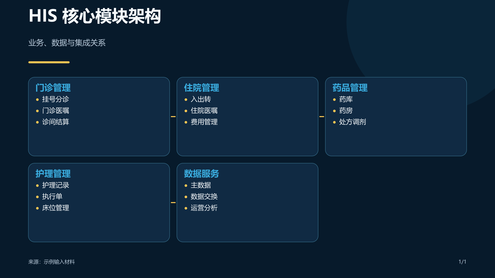

# Medical Infographic

`medical-infographic` 是面向 Codex 的医疗信息化信息图 Skill 与 Plugin。它将内容核验、图像素材和确定性 SVG 排版组合起来，生成适用于微信公众号、小红书和电脑/PPT 的可编辑信息图。

## 效果预览

| 电脑/PPT 16:9 | 小红书 3:4 | 微信公众号长图 |
| --- | --- | --- |
|  |  |  |

## 支持范围

- 医疗信息系统、智慧医院、医院运营和临床业务流程。
- 系统架构图、流程图、时间轴、对比矩阵、驾驶舱和场景解剖图。
- 微信公众号 `1080 × 6000` 长图。
- 小红书 `1080 × 1440` 多页卡片。
- 电脑/PPT `1920 × 1080` 页面。

不用于患者诊断、治疗建议或未脱敏病历处理。

## 在 Codex 中使用

使用内置安装器从公开仓库安装：

```text
使用 $skill-installer 安装：
https://github.com/anyou2006-ux/medical-infographic/tree/main/skills/medical-infographic
```

安装完成后，在下一次 Codex 任务中使用 `$medical-infographic` 显式调用。与医疗信息化信息图高度匹配的请求也可以隐式调用；若未出现新 Skill，重启 Codex 后重新检查。

安装为 Plugin 时，使用仓库根目录的 `.codex-plugin/plugin.json`。

示例请求：

```text
使用 $medical-infographic，把以下医院数据治理内容制作成 6 页小红书信息图。
channel: xhs-cards
layout: architecture
evidence_mode: balanced

内容：……
```

## 本地验证

```powershell
python -m unittest discover -s tests -v
python scripts/run_acceptance.py --output artifacts/acceptance
python scripts/verify_install.py --source skills/medical-infographic
python skills/medical-infographic/scripts/validate_content.py --spec examples/specs/01-his-architecture.json
python skills/medical-infographic/scripts/render_svg.py examples/specs/01-his-architecture.json --output-dir examples/generated/his
```

验收范围和人工检查步骤见 [验收检查表](docs/acceptance-checklist.md)，最近一次结果见 [验收报告](docs/acceptance-report.md)。

PNG 转换使用可选的 Node.js `sharp` 包：

```powershell
node skills/medical-infographic/scripts/render_png.cjs examples/generated/his/page-01.svg examples/generated/his/page-01.png
```

缺少 `sharp` 时保留 SVG，不影响 Skill 的基础使用。

## 开源内容

仓库公开 6 类版式规则和 12 个清理后的示例。原始 100 期提示词不随仓库发布，避免重复内容和过期事实进入运行时上下文。

## License

MIT
